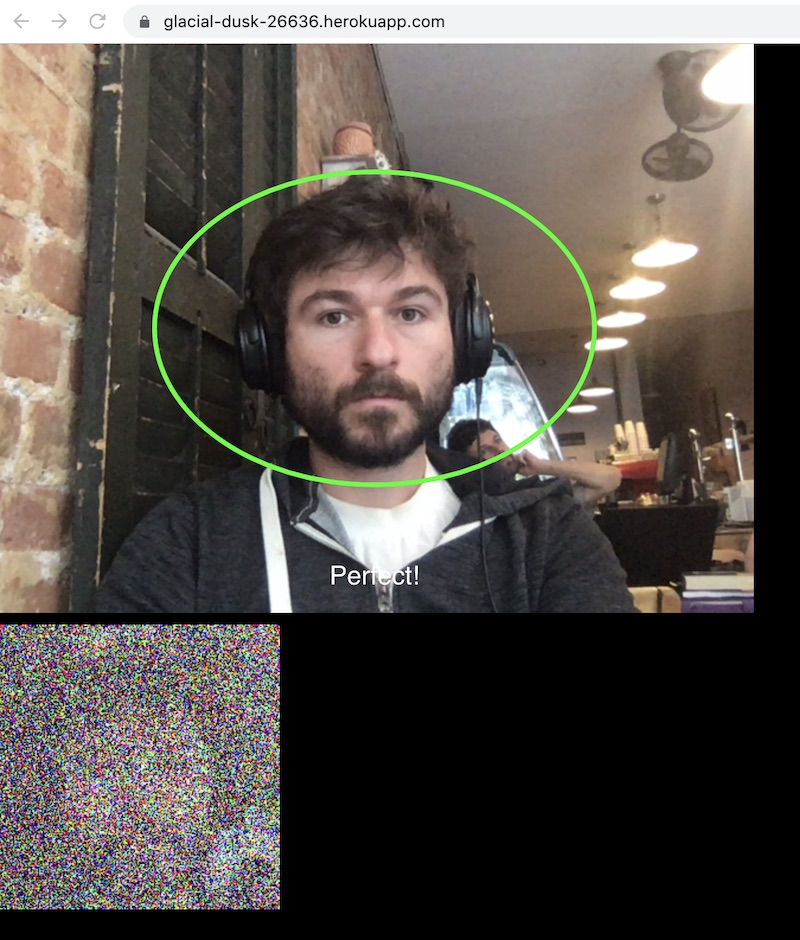

[](https://heroku.com/deploy)

This node/express app demonstrates the simplest way of calculating the average of a dataset while keeping all of the underlying data private. The client application opens up your camera and starts taking pictures of your face, obfuscating the image by salting random zero-centered numbers to the pixels, then sending the garbled images to the server. The server then takes the average of all the images. With a [large enough sample size](https://en.wikipedia.org/wiki/Law_of_large_numbers), the added noise cancels out (converges to zero) and you're left with approximately the average of the actual non-obfuscated data.


# Getting Started

0. Install [node](https://www.npmjs.com/get-npm) and [Heroku CLI](https://devcenter.heroku.com/articles/heroku-cli).

1. Clone the repo and install dependencies, then create heroku instance. 

  ```
  npm install
  heroku create
  ```

  Then whatever your app name is from Heroku, e.g. "cryptic-plains-03067"
  
  ```
  heroku buildpacks:set https://github.com/heroku/heroku-buildpack-nodejs#v160 -a cryptic-plains-03067
  ```
  
  Also install python requirements.
  
  `pip install -r requirements.txt --user`
  
2. Upload to heroku web app.

   `git push heroku master`

3. Start the python client which will collect the noisy images. Make sure to modify the `HOST` variable to your actual heroku url (e.g. `https://cryptic-plains-03067.herokuapp.com/` for heroku).

  `python collector_client.py`

5. Visit your app on the web and put your face in the circle... It will take pictures, obfuscate the image, and send to the server. You should see images begin to show up in the images folder of wherever you are running the python client.

The app looks something like this:



6. Ideally you capture at least 1000 images. It works best with many clients (>20!) at same time in a room. 

7. Take the average of all the collected images.

   `python calculate_avg.py`
   
   And you will see a file `myAverage.png` show up in the root directory which contains the average.
   

